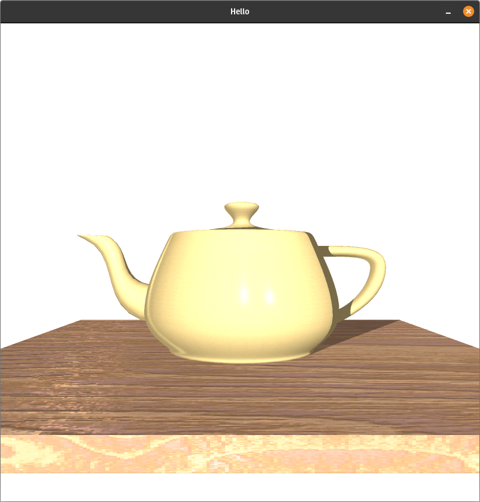

## What is this?

This is a very simple ray-tracer that uses the Möller–Trumbore intersection algorithm to create a scene made of triangles.

It uses the minifb library to create a window and draw to it and take keyboard input.

Heres an example render of the famous Utah Teapot, which is contained in the model file in the main directory and can be viewed by typing `cargo run model2.obj` in the main project directory and waiting several seconds.

## How do you use it?

This application uses a proprietary model format sort of like an .obj file, where you define vertices like:

`v <x> <y> <z>`

Vertex texture coordinates like:

`vt <x> <y> <z>`

Vertex normals like:

`vn <x> <y> <z>`

And then we can define triangles by linking together 3 groups of a vertex, a vertex texture coordinate, and a vertex normal like so:

`f <v1_index>/<vt1_index>/<vn1_index> <v2_index>/<vt2_index>/<vn2_index> <v3_index>/<vt3_index>/<vn3_index>`

The indices are 1-based with respect to the order they appeared in the model file.

To use a texture, we can use:

`t <file_name>`

and all subsequent triangles will be mapped to this texture.

Run the program with `cargo run <file>`.

## Misc

After parallelising the main loop, the image in this readme renders in about 6 seconds in release mode on an 8 core AMD CPU. 

High poly counts are handled by putting all the triangles into tree structure called an 'octree', the ray is recursively
intersected with the sub-trees of the octree to find which triangles to test for intersection, this dramatically decreases rendering speed.

Enough of the .obj and .mtl spec is implemented to generate an interesting image, most triangulated .obj and .mtl file combinations should
work, just some attributes won't have any visible effect. Models using quads will crash as quads aren't handled by the raytracer.

## Credit

['Computer Graphics From Scratch' for the basic principles](https://nostarch.com/computer-graphics-scratch)

['Geometry For Programmers' for more advanced 3D math](https://www.manning.com/books/geometry-for-programmers)

[This wikipedia article on the triangle intersection algorithm](https://en.wikipedia.org/wiki/M%C3%B6ller%E2%80%93Trumbore_intersection_algorithm)